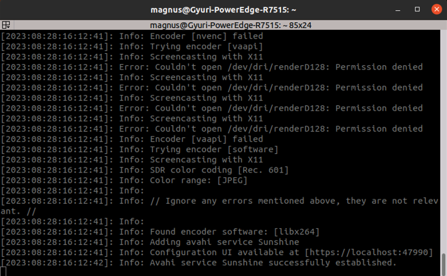

# Carla Tutorial

## Installation
The Carla simulator is built on the UnrealEngine4 (UE4) so for installing the simulator, the engine has to be installed first. A comprehennsive guide for the installation can be found in the [Carla documentation](https://carla.readthedocs.io/en/latest/build_linux/).

It's best to create a new conda environment for running the simulator to avoid dependency conflicts.

After installing and building Carla there will be two folders, namely UnrealEngine_4.26, the engine which contains the UnrealEditor, and carla, a cloned repository which contains the Carla plugin for the engine. It contains the PythonAPI for Carla which enables us to create a simulation environment and run tests using Python  scripts.

## Streaming
Since running the Carla simulator is very graphics-heavy, it is not feasible to run it using a regular remote access GUI on the server. Insteat, we use the Sunshine/Moonnlight tools which are made for video game streaming. 

First off, we need to install the Sunshine application on the server. Download the  application from [this](https://github.com/LizardByte/Sunshine/releases/tag/v0.20.0) website (I recommend downloading the AppImage, since it does not require installation).

Next, the client PC/laptop needs to have Moonlight installed. Click [here](https://github.com/moonlight-stream/moonlight-qt/releases) to find the correct version for your OS. 

Once both applications have been installed on the respective devices, the sunshine application can be launched, e.g. if you use the AppImage, just run:

    ./sunshine.AppImage

!!! NOTE !!!  
The sunshine application should be launched on the server using some graphical interface (e.g. Remote Desktop). If you launch it through ssh, Moonlight will think there is no monitor.

Inside the terminal, there will be a link to a site where you can adjust some settings (see image below, second line from the bottom). When connecting Moonlight for the first time, it will give a PIN and ask you to enter it on the sunshine site. Once, this is done, you are ready to connnect.

After connecting, it is okay to disconnect the Remote Desktop connection.

## Running Scenarios
There are two scenarios for the patch attacks, the static one and the dynamic one. For the static attack scenario, the patches are spawned in the environment directly, which corresponds to a physical adversarial attack, while for the dynamic attack scenario, the patches are placed on the camera image, which corresponds to manipulating the what the camera perceives.

For any scenario, the UnrealEditor needs to launched first. To do this, go into the root folder of the carla directory  and run:

    make launch

Once the editor has launched, the simulations has to be started by pressing the "Play" button in the top bar of the editor.

### Static Attack Scenario
To run a static attack scenario, you need to cd into the respective folder, i.e.:

    cd ~/{carla_directory}/PythonAPI/attack_scenario/static/   

There are two types of attacks we can  choose from, single attack and double attack. To choose whether to run a scenario with one or two patches, pass the corresponding parameter. Additionally you can pass a directory relative to the script to collect the output images.

To run e.g. the single patch, you will have to run

    python3 create_scenario_deterministic.py --single --output_dir outputs/
    
The script will automatically create subdirectories in the output directory for clean and patched images respectively.

### Dynamic Attack Scenario
To run the dynamic attack scenario, you first need to change to the right directory:

    cd ~/{carla_directory}/PythonAPI/attack_scenario/dynamic/

Since the dynamic attack manipulates the camera image, the patched and clean frames can be created simultaneously, so the simulation only has to be run once. Similar to the static attacks, you can choose between single patch and double patch attacks and decide where the outputs should be stored. Additionally, there is the option to pass a path to the patch that should be used for the attack.

    python3 create_scenario_deterministic.py --double --output_dir outputs/ --patch_path path/to/patch